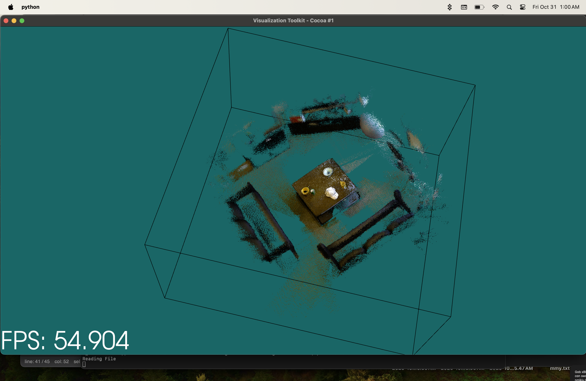
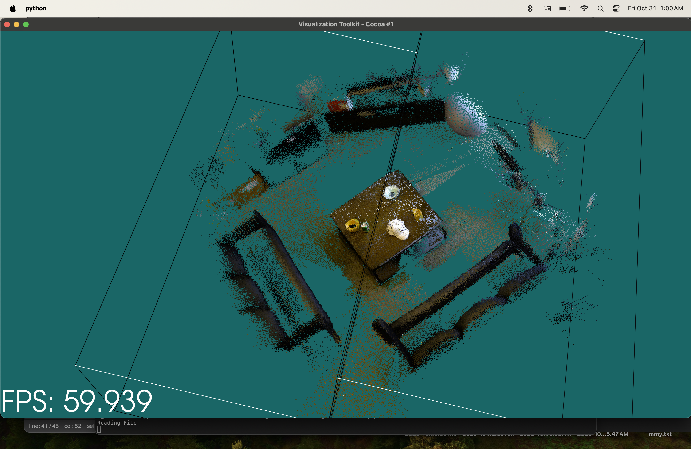

# 🌀 VTK Point Cloud Visualizer


> Showing the cloud with emissivity, many other interactive options to exploit.

An interactive **3D point cloud visualizer** built with **VTK** and **Python**, designed for real-time rendering of large, colored point clouds.  
The system features custom GLSL-like shaders, visibility filtering, dynamic frustum updates, and shader switching without reloading the scene.

---

## 🌐 Overview

The visualizer allows you to **load, render, and interact** with large-scale **PLY or VTP** point clouds.  
It provides a responsive rendering pipeline that supports:

- Dynamic shader control  
- Real-time frustum and visibility updates  
- Camera culling and level-of-detail performance  
- Accurate splat sizing with parallel projection  

It’s designed for research, visualization, and 3D graphics experimentation.





---

## ⚙️ Features

### 🔮 Functional Highlights

| Function | Description |
|-----------|-------------|
| **Parallel Projection** | Enables parallel projection mode for consistent scale and no perspective distortion when zooming in. |
| **Dynamic Shader Switching** | Allows real-time switching between shader types (e.g., sphere, diamond, octagon). |
| **Visibility Filtering** | Uses `vtkSelectVisiblePoints` to render only points visible to the camera. |
| **Frustum Culling** | Dynamically filters nodes outside the camera’s frustum for better performance. |
| **Emissivity Control** | Each shader supports emissivity toggling for glow and lighting effects. |
| **Adjustable Splat Scale** | Each shader preset defines its own splat scale to control point footprint size. |
| **Custom Shader Definitions** | Supports GLSL-like shader definitions embedded via VTK’s shader replacement hooks. |
| **RGB Support** | Preserves RGB color information when reading PLY or VTP files. |
| **Multi-Process Extraction** | Optionally extracts visible nodes using multiprocessing for scalability. |

---

## 🎨 Shader Presets

All shader definitions are contained in **`VTKShaderPresets.py`**.  
Each preset includes a custom fragment shader snippet and a corresponding scale factor.

**Available Presets:**

- `SPHERE`
- `BLACK_EDGED_CIRCLE`
- `PLAIN_CIRCLE`
- `TRIANGLE`
- `DIAMOND`
- `OCTAGON`
- `OBLONG_OCTAGON`
- `SQUARE`
- `SQUARE_OUTLINE`
- `CUSTOM`


**Shader Example:**
```glsl
//VTK::Color::Impl
float dist = dot(offsetVCVSOutput.xy, offsetVCVSOutput.xy);
if (dist > 1.0) {
  discard;
} else {
  float scale = (1.0 - dist);
  ambientColor *= scale;
  diffuseColor *= scale;
}
```

Each shader preset is associated with a default scale, e.g.:
```python
self.Shaders = [
  [self.SPHERE, 0.165],
  [self.BLACK_EDGED_CIRCLE, 0.165],
  [self.DIAMOND, 0.265],
  [self.OCTAGON, 0.09],
  [self.SQUARE, 0.1],
  [self.CUSTOM, 0.155]
]
```

You can switch shaders during runtime to instantly visualize different shapes and splat styles.

---

## 🟢 Frustum Calculation

The UpdateFrustum class continuously updates the active camera’s frustum as the user moves or zooms:
```python
aspect = renderer.GetAspect()
aspectRatio = aspect[0] / aspect[1]
planes = [float()] * 24
renderer.GetActiveCamera().GetFrustumPlanes(aspectRatio, planes)
vtkPlanes.SetFrustumPlanes(planes)
```

A `vtkFrustumSource` object is created to visualize or reference these bounds.
```python
fs = vtk.vtkFrustumSource()
fs.SetPlanes(vtkPlanes)
fs.Update()
self.handleVTKCloud.frustum = fs.GetOutput()
```

This frustum data is passed to visibility filters for real-time view-dependent rendering.

---

## 🔵 Visibility Filtering

`FilterOccludedPoints.py` filters the visible subset of points from each node based on the current frustum.
```python
svp = vtk.vtkSelectVisiblePoints()
svp.SetInputData(rootNode.data.bstPolyData)
svp.SetRenderer(self.handleVTKCloud.renderer)
svp.Update()
```

It then remaps the visible subset using a shader-aware Gaussian mapper:
```python
pg_mapper = vtk.vtkPointGaussianMapper()
pg_mapper.SetInputData(svp.GetOutput())
pg_mapper.SetScalarVisibility(True)
pg_mapper.SetEmissive(False)
pg_mapper.SetSplatShaderCode(shader_code)
pg_mapper.SetScaleFactor(scale)
```

This ensures that only visible, correctly shaded points are drawn, improving both speed and clarity.

---

## 🟣 Parallel Projection

To prevent corner clipping and maintain geometric fidelity during zoom, parallel projection mode is used instead of perspective projection:
```python
camera = renderer.GetActiveCamera()
camera.SetParallelProjection(True)
```

This provides:
- Uniform point sizing at any zoom level
- No warping at frustum edges
- Ideal rendering for dense planar clouds

---

## File Structure

```bash
src/
│
├── visualizer.py                  # Entry point of the visualizer
├── VTKShaderPresets.py      # Shader definitions and scales
├── FilterOccludedPoints.py  # Filters visible points per frame
├── UpdateFrustum.py         # Updates and manages camera 
├── BSTPointCloud.py         # Organizes point cloud nodes
├── NodeVisibility.py        # Handles visibility flags
├── BinarySearchTree.py      # BST logic for point partitioning
├── utils.py                 # Functions that work in visualizer
├── data/
│   └── example.vtp          # Converted VTK PolyData
└── README.md
```

---

## 🚀 Running the Visualizer

1️⃣ Install Dependencies
```bash
pip install vtk numpy
```

2️⃣ Run the Visualizer
```bash
python visualizer.py
```

While running:
- Move/rotate camera
- Zoom in/out
- Toggle shaders in real-time
- Observe visibility filtering and culling behavior

---

## 🧠 Core Classes

| Class | Description |
|--------|-------------|
| **VTKShaders** | Defines shader presets and scales for splatting |
| **UpdateFrustum** | Updates frustum planes based on camera |
| **FilterOccludedPoints** | Selects and maps only visible point subsets |
| **BSTPointCloud** | Spatial partitioning for fast traversal |
| **NodeVisibility** | Tracks node visibility state |
| **BinarySearchTree** | Supports efficient node search and organization |

---

## 🧩 Summary

The VTK Point Cloud Visualizer is a full-featured 3D visualization framework optimized for performance, flexibility, and clarity.

It integrates custom shaders, dynamic visibility, and real-time culling — delivering efficient exploration of massive RGB point clouds.
